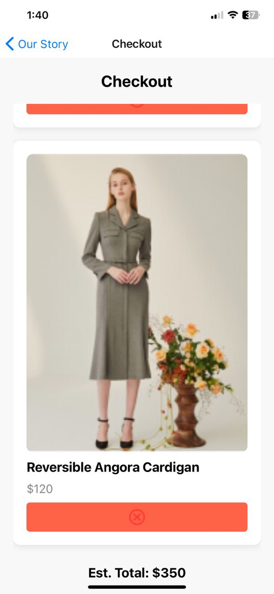
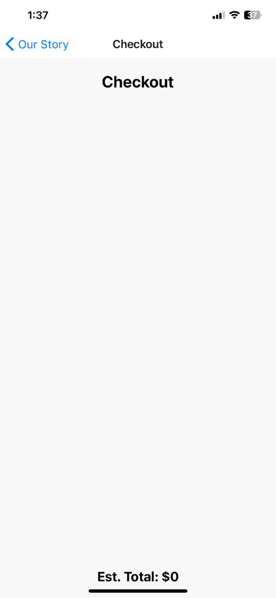

# React Native To-Do List App
=============================

This project is a React Native application designed to showcase a simple to-do list user interface. It provides an intuitive interface for managing tasks, including adding tasks, marking tasks as completed, and deleting tasks.

## Features
------------

* **Add Tasks**: Easily add new tasks to the to-do list with a few taps.
* **Mark as Completed**: Mark tasks as completed and strike them through.
* **Delete Tasks**: Remove tasks from the to-do list.
* **Responsive Design**: Designed to work seamlessly on both Android and iOS devices.

## Getting Started
---------------

To get started with this project, follow these steps:

### Prerequisites

Make sure you have Node.js and npm installed on your machine.

### Clone the Repository

Clone this repository to your local machine.

### Install Dependencies

Navigate into the project directory and install all necessary dependencies.

### Run the Application

Start the Metro Bundler and run the application on your preferred emulator or device.

### Explore

Once the application is running, explore the to-do list interface, add tasks, mark tasks as completed, and delete tasks.

## Screenshots
-------------

## Contributing
------------

Contributions are welcome! If you have any suggestions, enhancements, or bug fixes, please feel free to open an issue or submit a pull request.

## Acknowledgments
---------------

* **React Native**: A JavaScript framework for building native mobile apps using React.
* **Expo**: Tools and libraries for building native iOS and Android apps with React Native.
* **Icons**: Icons used in this project are from FontAwesome and Material Icons.